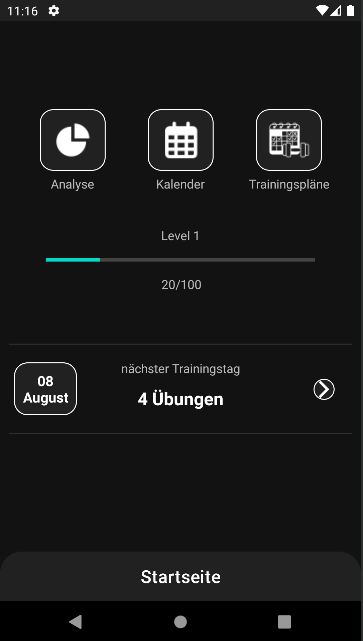
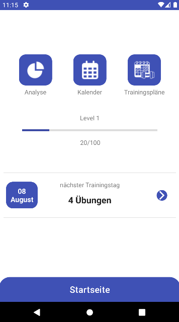

# deprecated! remake:
https://github.com/sdresselmann/Lifting-Progress-Tracker


# Beschreibung
App Fitness-Planer in dem der Nutzer eigene Trainingspläne hinzufügen und konfigurieren kann.





# Gradle

### Projekt aufsetzen
```
gradlew build
```

### Code linting
```
gradlew lint
```

### Unit und UI Tests
```
gradlew test
```
